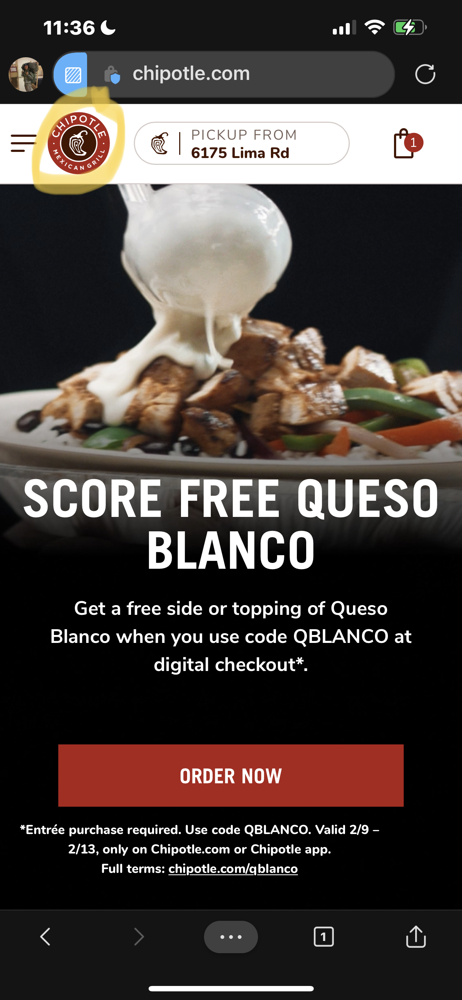
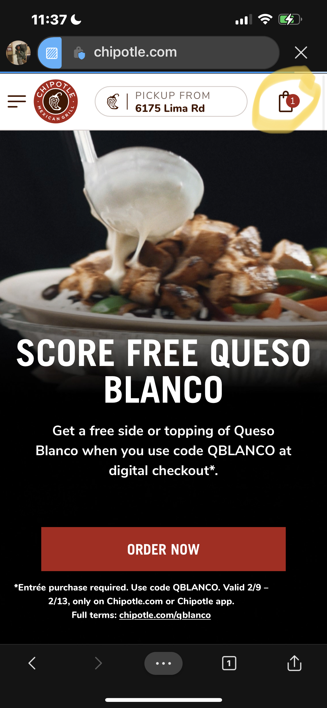
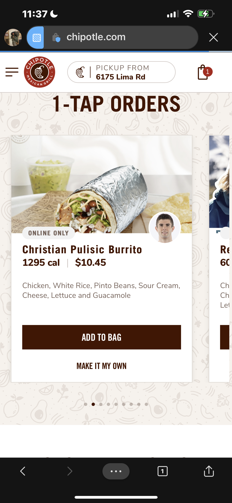
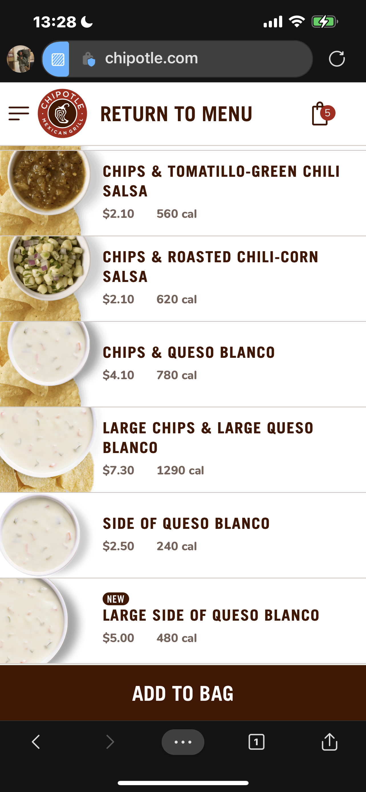
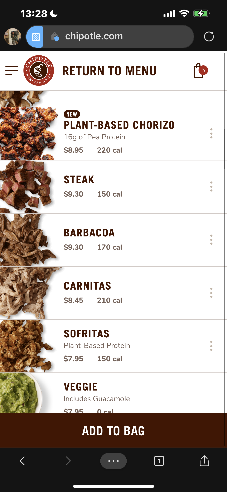
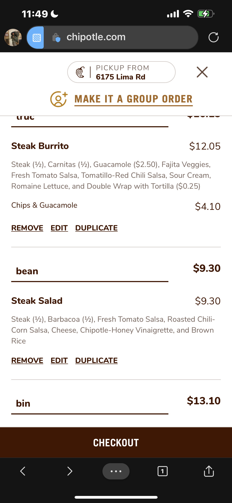

## Part I:
- Product walk through
- Navigate as the first time user
- Check if the dedign match expectation

## Prep:
- Open private window in Edge
- Navigate to Chipottle.com
- Use Location 46825
- Create 3 diffrent order (**NO CATERNG**)

### Test functionality:
- Test the responsiveness of button and link: **All Pass**
- Test the color consistency: **All Pass**

### Home Page Evaluation:
#### 1. Structure:
```bash
.
└── Home Page/
    ├── Order Now(1 click) -> Food Options(10 or more) -> Name(2) -> Review (1) -> Check Out(1)
    ├── Sign in/
    │   └── Enter Username, Password (2 clicks) 
    ├── Register/
    │   └── Register Account (10 clicks)
    └── Order With 1-Tap(1 click) -> Name(2) -> Review (1) -> Check Out(1)
```
#### 2. Evaluation:
```diff
Expected:
+ Home Button work as expect and through all the pages
+ refreshing pages work as expected and store the previous food that confirm in order
+ Good design with 'sign in' and 'register button' is optional

Need Improve:
- Lacking smothness on the 1-Tap menu: images is delay and not smooth when scrolling
- Order Now stay on top and took More than 15 Click to get the food
- Order With 1-Tap took 5 cliks to check out and stay on the bottom (not make sense for 1st time user)
```

#### 3. Explain:

- Home Button: 
  - work as expect and through all the pages provide user control freedom
  - design looks good and focus on the main page



- Refreshing Button:
  - work as expected 
  - store the previous food that confirm (even after refreshing or come back later). User don't lost their order



- 1 Tab-Order Section:
  - Scrolling is not smooth
  - Useful but set in the bottom of the mobile app. 
  - User will not pay attention to the exist of this feature, may go somewhere else (since many clicks on the order food)



### The Build-Your-Own-Food Page Evaluation:
#### 1. Structure:
```bash
# Too many option put on 1 pages this can definately confused people
.
└── Order/
    ├── Buritto/
    │   ├── Nutrion Preferences (Filter the options -> faster)(same click but less cross)
    │   ├── Protein or Vegie /
    │   │   ├── Chicken
    │   │   ├── Steak
    │   │   ├── Plant Based
    │   │   └── ...
    │   ├── Rice/
    │   │   ├── White Rice
    │   │   └── ...
    │   ├── Beans/
    │   │   ├── Black Beans
    │   │   └── ...
    │   ├── Top Thing Off/
    │   │   ├── Sour cream
    │   │   ├── cheese
    │   │   ├── Romaine lecture
    │   │   └── ...
    │   ├── Option/
    │   │   └── Double wrap
    │   ├── Side/
    │   │   ├── Totilaon the side
    │   │   ├── Chip
    │   │   ├── Guacamole
    │   │   └── ...
    │   └── Drink/
    │       └── ...
    ├── Burito Bowl/
    │   └── ...
    ├── Lifestyle Bowl/
    │   └── ...
    ├── Salad/
    │   └── ...
    └── ...
```
2. Evaluation:
```bash
Expected:
+ Food Picture is respnsive and easy to choose from
+ Enter a meal name is a good idea: we only need to change 1 meal and complete in a few click
+ Refreshing clear all the form as expected
+ Not process to the next page unless choose the main dish (meat, bean, rice...) -> Good exception handling
+ Option (Remove - Edit - Duplicate) is nice to have
+ Hyperlink work as expected

Need Improve:
- The click to customize button need more responsive. Accidently click on that can cause a pop up menu
- The (-) button need more responsive
- The option for food is way too long -> need cut short (e.g. hidden menu)
- Check out need more pop (stay in the bottom and dark theme)
```
- The menu overview:
  - The (-) button need more responsive: (+) is easy to click on, but (-) has to do many time for 1 click





- The click to customize button need more responsive. Accidently click on that can cause a pop up menu


- Check out need more pop (stay in the bottom and dark theme)



### The Check Out Page:
- Evaluation
```bash
Expected:
+ Has the option to change pickup location
+ Users can choose the pickup time until user want to pickup (within day) -> flexible
+ Guess Check out, so do not force user to sign in or register
Need Improve:
- Credit Card is the only pament option (should add more: Paypal (1 click check out))
- Submit button need more clear
```

## Task 2:
- Jakob's Ten Usuability Heuristics
### Visibility of System Status:
- application show what user need to go next in a few steps ✅
### Match between System and Real World
- The (-) button need more responsive: the (+) is easy to click on, the (-) has to do try many time for 1 click


### User control and freedom.
- Navigation Drop down menu is not resposible, make user annoy when trying to navigate (not fully control)


### Consistency and standards.
- Design and font is consistent ✅

### Error prevention.
- Application show messages and also prevent user make mistakes (e.g. when user forgot to choose
a main disk from the options. Application will prevent user from processing the next steps. Even 
though users do not want something, they have to choose no.)  ✅

### Recognition rather than recall.
- The user should not have to remember information from one part of the interface to another  ✅

### Flexibility and efficiency of use.
- 1 Tab-Order Section:
  - Scrolling is not smooth
  - Useful but set in the bottom of the mobile app. 
  - User will not pay attention to the exist of this feature -> they don't know they can make short cut and check out faster
  


- The (-) and (+) button should be bigger

### Aesthetic and minimalist design.
- The option for food is way too long -> need cut short(e.g. hidden menu)


### Recognize, diagnose, recover from errors.

- Error messages is expressed in plain languages, and suggest a solution ✅

### Help and documentation.
- All Help and documentation work as expected ✅
 